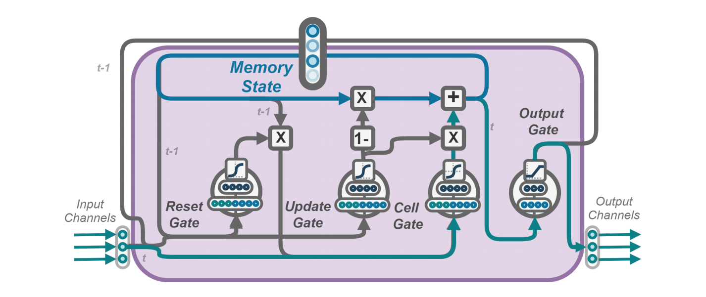

# Evolable Neural Units (ENU)



Unofficial PyTorch Implementation of:
[Network of Evolvable Neural Units: Evolving to Learn at a Synaptic Level](https://arxiv.org/abs/1912.07589).

## Results

Validation result on for Evolable Nueral Units:

| Top 1 accuracy (%)         | Paper | Here |
| -------------------------- | ----- | ---- |
| Pending | Pending  | Pending |


## Dependencies

This code was tested on Python 3.6 with PyTorch 1.0.1. Other packages can be installed by:
```bash
pip install -r requirements.txt
```


## Train Evolable Neural Units (ENU)

## Validation

## Author

## License

